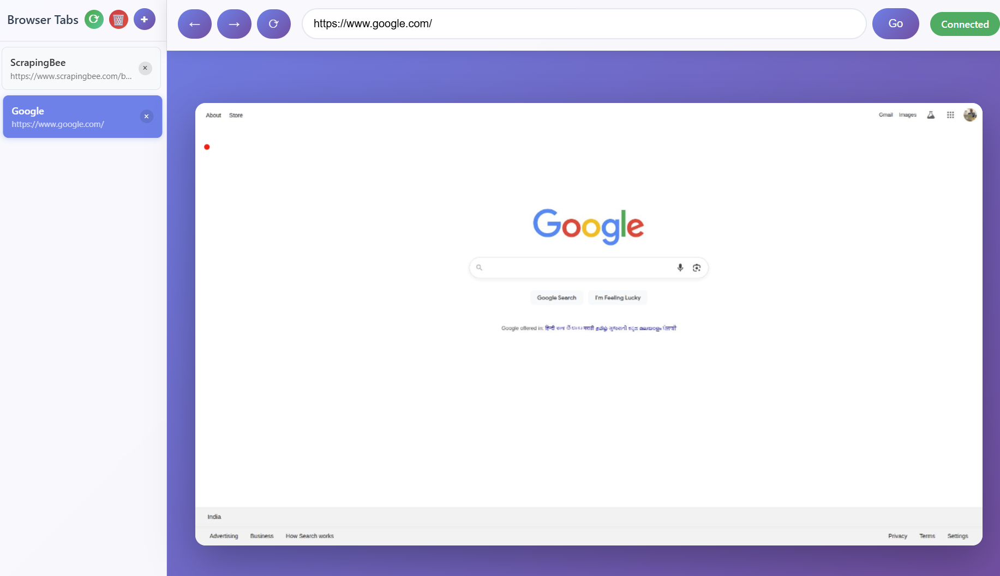
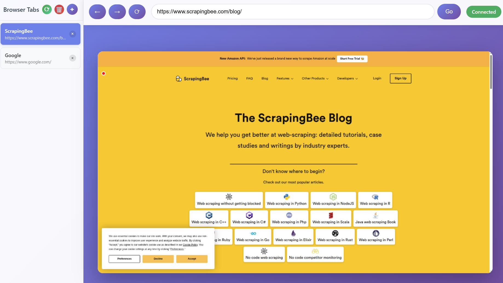

# Remote Browser Control System

A FastAPI-based web application that allows clients to control a headless Playwright browser through a VNC-style web interface with real-time mouse and keyboard control, featuring advanced multi-tab management.





## Features

- **Real-time Browser Control**: Control a headless Playwright browser through a web interface
- **VNC-style Interface**: Mouse and keyboard control with live screenshot streaming
- **Multi-Tab Management**: Create, switch between, and close browser tabs with sidebar interface
- **Visual Mouse Cursor**: Red dot indicator showing cursor position on canvas
- **Tab Management Controls**: Add, switch, close, refresh, and cleanup tabs
- **Automatic Page Cleanup**: Detects and removes closed pages automatically
- **Duplicate Tab Prevention**: Prevents and cleans up duplicate tabs
- **Broadcast Updates**: Real-time updates to all connected clients
- **Persistent Browser State**: Uses existing browser data directory for session persistence
- **Modern Web Interface**: Responsive design with real-time status indicators and sidebar
- **WebSocket Communication**: Low-latency bidirectional communication
- **Cross-platform**: Works on Windows, macOS, and Linux

## Requirements

- Python 3.8+
- Playwright browser binaries
- Modern web browser for the control interface

## Installation

1. **Activate conda environment:**
   ```bash
   conda activate TheOneEyePoc
   ```

2. **Install Python dependencies:**
   ```bash
   pip install -r requirements.txt
   ```

3. **Install Playwright browsers:**
   ```bash
   playwright install chromium
   ```

4. **Start the application:**
   ```bash
   python app.py
   ```

5. **Open your web browser and navigate to:**
   ```
   http://localhost:8001
   ```

## Usage

### Web Interface Controls

- **Mouse Control**: Click and drag on the browser viewport to interact
- **Keyboard Input**: Click on input fields and type normally
- **Scrolling**: Use mouse wheel to scroll pages
- **Navigation**: Use the URL bar and navigation buttons
- **Right-click**: Right-click for context menus

### Tab Management

- **Add New Tab**: Click the "+" button in the sidebar to create a new tab with Google.com
- **Switch Tabs**: Click on any tab in the sidebar to switch to that page
- **Close Tabs**: Click the "×" button on individual tabs (minimum 1 tab required)
- **Refresh Tabs**: Click the "⟳" button to refresh the tabs list
- **Cleanup**: Click the "🗑️" button to cleanup closed pages

### Keyboard Shortcuts

- **Enter**: Submit forms or activate buttons
- **Tab**: Navigate between form elements
- **Arrow Keys**: Navigate within pages
- **F5**: Refresh page
- **Ctrl+A**: Select all
- **Ctrl+C**: Copy
- **Ctrl+V**: Paste

## Architecture

### Components

- **`app.py`**: FastAPI application with WebSocket endpoints and tab management
- **`browser_manager.py`**: Singleton class managing Playwright browser instance with multi-page support
- **`static/index.html`**: Web interface HTML with sidebar tab management
- **`static/styles.css`**: Modern responsive styling with tab interface
- **`static/app.js`**: Client-side JavaScript for browser control and tab management

### Communication Flow

1. Client connects via WebSocket to `/ws` endpoint
2. Server streams screenshots at 10 FPS to client
3. Client sends mouse/keyboard events to server
4. Server translates events to Playwright commands
5. Browser executes commands and updates viewport
6. Tab management events are handled through dedicated WebSocket messages
7. Server broadcasts updates to all connected clients

### Browser Configuration

The browser runs with the following settings:
- **Headless mode**: Browser runs without visible window
- **Viewport**: 1920x1080 resolution
- **User agent**: Chrome 140.0.0.0
- **Anti-detection**: Disabled automation indicators
- **Multi-page support**: Multiple tabs with individual page management

## API Endpoints

### REST Endpoints

- `GET /` - Main control interface
- `GET /health` - Health check
- `GET /static/*` - Static files

### WebSocket Endpoints

- `WS /ws` - Browser control communication

### WebSocket Message Types

**Client to Server:**
```json
{
  "type": "mouse_move",
  "x": 100,
  "y": 200
}
```

```json
{
  "type": "mouse_click",
  "x": 100,
  "y": 200,
  "button": "left"
}
```

```json
{
  "type": "mouse_down",
  "x": 100,
  "y": 200,
  "button": "left"
}
```

```json
{
  "type": "mouse_up",
  "x": 100,
  "y": 200,
  "button": "left"
}
```

```json
{
  "type": "mouse_wheel",
  "deltaX": 0,
  "deltaY": 100
}
```

```json
{
  "type": "key_press",
  "key": "Enter"
}
```

```json
{
  "type": "key_type",
  "text": "Hello World"
}
```

```json
{
  "type": "navigate",
  "url": "https://example.com"
}
```

```json
{
  "type": "go_back"
}
```

```json
{
  "type": "go_forward"
}
```

```json
{
  "type": "refresh"
}
```

```json
{
  "type": "get_pages"
}
```

```json
{
  "type": "switch_page",
  "page_index": 0
}
```

```json
{
  "type": "close_page",
  "page_index": 0
}
```

```json
{
  "type": "add_tab"
}
```

```json
{
  "type": "refresh_pages"
}
```

```json
{
  "type": "force_cleanup"
}
```

**Server to Client:**
```json
{
  "type": "screenshot",
  "data": "base64_encoded_image",
  "viewport": [1920, 1080]
}
```

```json
{
  "type": "pages_info",
  "pages": [
    {
      "index": 0,
      "url": "https://example.com",
      "title": "Example Page",
      "active": true
    }
  ]
}
```

```json
{
  "type": "page_switched",
  "success": true,
  "page_index": 0
}
```

```json
{
  "type": "page_closed",
  "success": true,
  "page_index": 0
}
```

```json
{
  "type": "tab_added",
  "success": true
}
```

## Development

### Project Structure
```
remotebrowser/
├── app.py                    # FastAPI application with tab management
├── browser_manager.py        # Browser control logic with multi-page support
├── requirements.txt          # Dependencies
├── static/
│   ├── index.html           # Web interface with sidebar
│   ├── styles.css           # Styling with tab interface
│   └── app.js               # Client JavaScript with tab management
├── browser_data/            # Browser data directory
└── README.md                # This file
```

### Running in Development

```bash
# Activate conda environment
conda activate TheOneEyePoc

# Install dependencies
pip install -r requirements.txt
playwright install chromium

# Run the application
python app.py

# Or with uvicorn directly
uvicorn app:app --host 127.0.0.1 --port 8001 --reload
```

### Customization

- **Screenshot Quality**: Modify `quality=80` in `browser_manager.py`
- **Streaming FPS**: Change `await asyncio.sleep(0.1)` in `app.py`
- **Viewport Size**: Update `_viewport_size` in `browser_manager.py`
- **Browser Args**: Modify browser launch arguments in `browser_manager.py`

## Troubleshooting

### Common Issues

1. **Browser won't start**: Ensure Playwright is installed with `playwright install chromium`
2. **WebSocket connection fails**: Check firewall settings and port availability
3. **Screenshots not updating**: Verify browser is running and responsive
4. **Mouse/keyboard not working**: Check browser focus and event handling
5. **Canvas not displaying screenshots**: Check browser console for JavaScript errors
6. **WSL/Linux issues**: Ensure conda environment is activated before running
7. **Duplicate tabs appearing**: Use refresh tabs or cleanup button to remove duplicates
8. **Tabs not updating after closing**: Use force cleanup button to remove closed pages
9. **Tab switch not working**: Closed page detection and auto-cleanup should handle this
10. **Multiple clients showing different tab states**: Broadcast updates handle synchronization

### Logs

The application logs important events:
- Browser initialization
- WebSocket connections
- Client message handling
- Tab management operations
- Page switching and cleanup
- Error conditions

Check console output for debugging information.

## Security Considerations

- **Local Access Only**: By default, the server binds to `127.0.0.1:8001`
- **No Authentication**: The interface has no built-in authentication
- **Browser Security**: Uses persistent context with existing browser data
- **Tab Isolation**: Each tab maintains its own security context
- **Multi-Client Support**: Multiple WebSocket clients with broadcast updates
- **Network Security**: Consider using HTTPS in production

## License

This project is for educational and development purposes.
